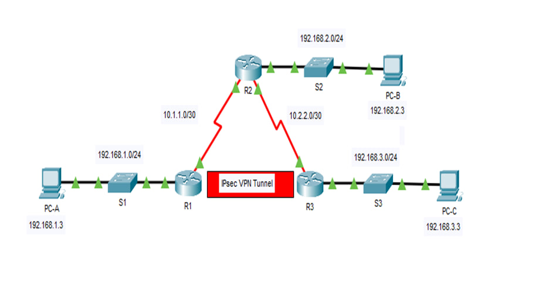
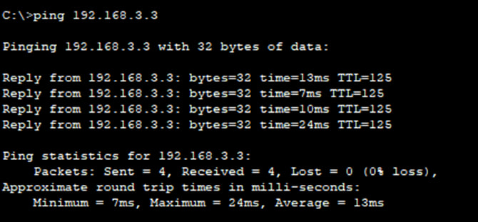
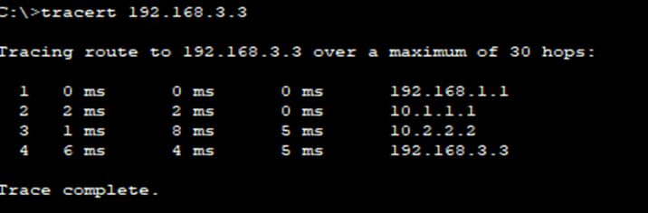
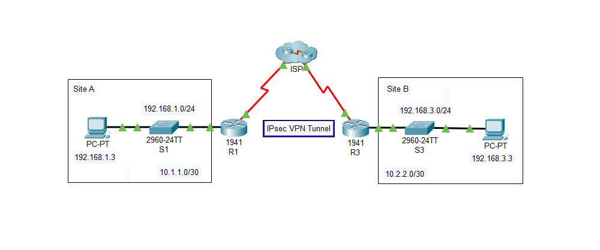
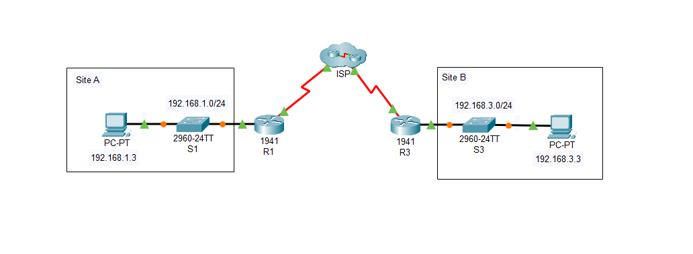

# IPSec Site-to-Site VPN Project

## 🎓 Graduation Project – Computer Science & Engineering  
**Course:** CSE 419  
**Advisor:** Abdullah Alshammari  
**Term:** 2nd Term, April 2025  

This project demonstrates the design, configuration, and verification of a **Site-to-Site IPSec VPN** using Cisco Packet Tracer.  
Routers R1 and R3 establish an encrypted tunnel across an untrusted network, ensuring confidentiality, integrity, and authentication of transmitted data.

---

## 📌 Problem Statement
Modern organizations face increasing risks when transmitting sensitive data over untrusted networks such as the Internet.  
Without proper security, traffic can be intercepted, altered, or stolen, leading to severe financial and reputational losses.  
This project addresses the issue by implementing a **secure IPSec tunnel** to protect communication between two LANs.

---

## 📖 Background
- **IPSec:** A protocol suite for authenticating and encrypting IP packets.  
- **VPN:** Provides secure connectivity over insecure networks.  
- **Encryption:** Ensures data confidentiality.  
- **ACLs:** Define "interesting traffic" that should be encrypted.  

Existing solutions include commercial VPN services (Cisco AnyConnect, NordVPN), open-source tools (OpenVPN, StrongSwan), and enterprise VPN appliances.  
Our project uses **Cisco Packet Tracer** for simulation and education.

---

## 🛠️ Requirements and Specifications
- **Functional:**  
  - Secure data transmission (AES-256).  
  - User authentication with pre-shared keys.  
  - Access control for defined subnets.  
- **Non-Functional:**  
  - VPN tunnel setup < 5 seconds.  
  - Support for scalability and multi-endpoint connectivity.  
- **Technical:**  
  - AES-256 encryption, SHA-1 hashing.  
  - DH Group 5 (simulation limitation).  
  - Throughput goal ≥ 1 Gbps (theoretical).  

---

## 🏗️ System Design
### Network Topology


- **R1 ↔ R3:** VPN endpoints  
- **R2:** Transit router (pass-through)  
- **PC-A ↔ PC-C:** Communication tested through encrypted tunnel  

### Addressing Table
| Device | Interface | IP Address | Subnet Mask | Notes |
|--------|-----------|------------|-------------|-------|
| R1 | G0/0 | 192.168.1.1 | 255.255.255.0 | LAN |
| R1 | S0/0/0 | 10.1.1.2 | 255.255.255.252 | To R2 |
| R2 | S0/0/0 | 10.1.1.1 | 255.255.255.252 | To R1 |
| R2 | S0/0/1 | 10.2.2.1 | 255.255.255.252 | To R3 |
| R3 | S0/0/1 | 10.2.2.2 | 255.255.255.252 | To R2 |
| R3 | G0/0 | 192.168.3.1 | 255.255.255.0 | LAN |
| PC-A | NIC | 192.168.1.3 | 255.255.255.0 | Gateway R1 |
| PC-C | NIC | 192.168.3.3 | 255.255.255.0 | Gateway R3 |

---

## 🔑 Implementation
### ISAKMP (Phase 1)  
- AES-256 encryption  
- SHA-1 hashing  
- DH Group 5  
- Pre-shared key: `vpnpa55`  

### IPSec (Phase 2)  
- Transform Set: ESP-AES with ESP-SHA-HMAC  
- Crypto Map applied to serial interfaces  
- ACL 110 defines interesting traffic (192.168.1.0/24 ↔ 192.168.3.0/24)  

---

## ✅ Verification
1. Verified baseline connectivity with `ping`  
   

2. Verified encrypted tunnel with `tracert`  
   

3. Network diagram in Cisco Packet Tracer (with IPSec)  
   

4. Without IPSec (for comparison)  
   

---

## 📊 Testing & Evaluation
- **Before VPN:** Plain connectivity works but unencrypted.  
- **After VPN:** Tunnel is triggered only by interesting traffic.  
- **Uninteresting traffic:** Verified as not encrypted.  
- **Performance:** Low latency and stable tunnel creation in Packet Tracer.  

---

## ⚙️ Engineering Tools & Standards
- **Tools:** Cisco Packet Tracer, Wireshark (conceptual), CLI.  
- **Standards:** AES-256, IKEv2/ISAKMP, ESP, SHA-1.  
- **Compliance:** Aligns with modern VPN encryption practices.  

---

## 🤝 Team Members
- Yazan Fahad  
- Mohammed Alharbi  
- Bandar Almutairi  
- Meshal Mohammed  
- **Hatem Alhamar**  
- Abdulaziz Aldughaim  

---

## 📌 Conclusion
We successfully implemented a **Site-to-Site IPSec VPN** in Cisco Packet Tracer.  
The project provided hands-on experience in:  
- Configuring ISAKMP & IPSec phases.  
- Defining and encrypting interesting traffic.  
- Testing secure vs. insecure communication paths.  

🔮 *Future work:* add real-time monitoring, simulate attacks, and test advanced encryption algorithms.  

---
## 📂 Repository Contents

```text
ipsec-vpn-project/
├── README.md
├── docs/
│   ├── project-report.pdf
│   ├── Poster.pdf
│   ├── Presentation.pptx
│   ├── poster2.pptx
│   └── screenshots/
│       ├── topology.jpg
│       ├── ping.jpg
│       ├── tracert.jpg
│       ├── ipsec.png
│       └── Noipsec.png
└── packet-tracer/
    ├── Ipsec_tunnel.pkt
    └── No_Ipsec_tunnel.pkt

